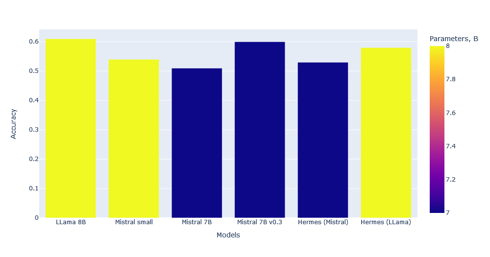
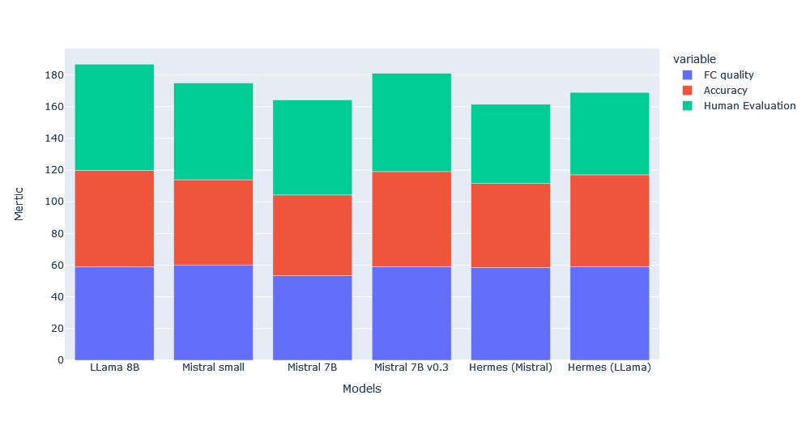

# MorphyLLM

## Introduction

A week ago, a new Mistral AI model was released, which showed a significant increase in metrics relative to what we used before. In addition, the model was trained assuming a function call. Unfortunately, the vanilla model does not work so well with the task of calling functions, because it is too general.

## Motivation

We are interested in MorphyLLM becoming one of the core models for both local smart agents and NFAs. MorphyLLM can be effective not only for providers providing the compute resources for the users requested AI model to the user, but also for running the model locally by the user.

We tested a few models which are opensource and have not so much parameters. Currently we using Hermes model (finetuned LLama 8B). And Mistal v0.3 shows better or equal results compare to LLama 8B, having less parameters and more context. And the context is very important in our task, so the size of the model. The fewer parameters there are in the model, the easier it is to run it on a regular computer. This in turn reduces the tech requirements for the provider node and makes it more accessible to potential providers, while maintaining the accuracy of function calling responses.

## Model Details

This model is a finetune "Mistral 7B Instruct v0.3". The repository offers the train code, and the model can be downloaded after the end of the training.

## Experimental Training Methods

We also decided to experiment with which training method is preferable. The current method assumes an SFT (Supervised Finetune Training) quantized to 4 bit via a peft (the framework which) model. We use opensource function calling and tool-chaining datasets (includes web3 tasks), used to train Hermes. Also we working with LORA-based training methods, like Q-LORA for quick testing the hypothesis

## Future vision

We are going to change the training methodology to a more complex and expensive one, but with better results.
Also we working to create our benchmark for special task to have more relevant information about models quality.
We have a lot of hypothesis to test which need a lot of time but could give much better results.
Also we experimenting with quantization of bigger models and the using of it in production.
